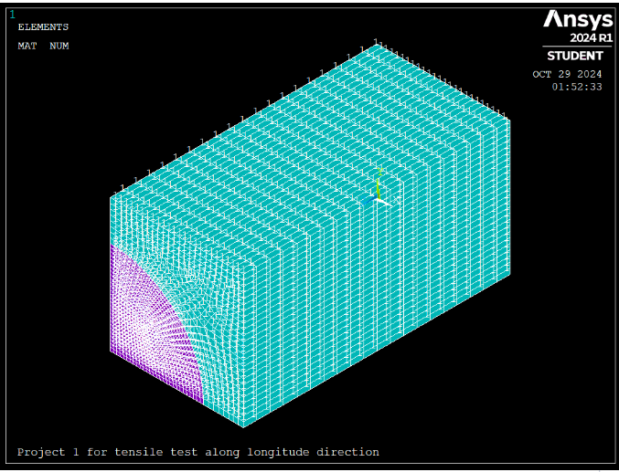
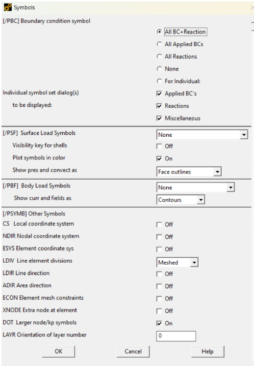
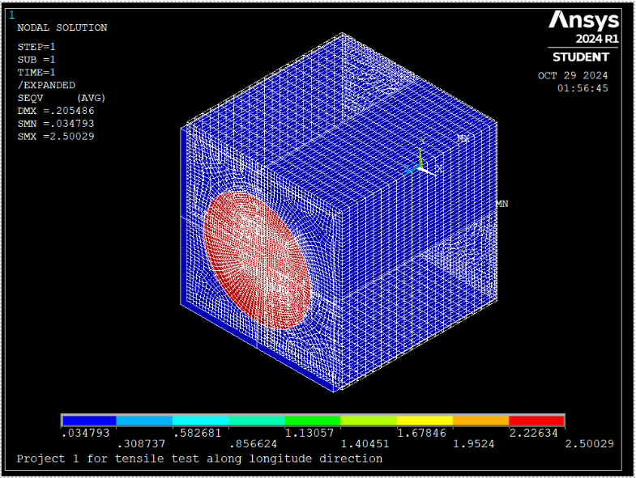

=# Tensile Test on Fiber-Reinforced Composite

This repository contains the scripts, images, and results for a project conducted as part of the course **ME 792**, supervised by **Dr. Hu**. The project focuses on predicting the material properties of unidirectional fiber-reinforced polymer matrix composites using both theoretical models and simulations in ANSYS APDL.

## Table of Contents
1. [Abstract](#abstract)
2. [Introduction](#introduction)
3. [Project Procedure](#project-procedure)
4. [ANSYS Simulation Script](#ansys-simulation-script)
5. [Results](#results)
6. [How to Use](#how-to-use)

---

## Abstract
This project aims to predict the mechanical properties of a unidirectional fiber-reinforced polymer matrix composite by conducting tensile tests along the fiber longitudinal direction. Key properties such as longitudinal and transverse Young’s moduli (\(E_L\) and \(E_T\)) and Poisson’s ratios (\(\nu_{LT}\), \(\nu_{TL}\)) were determined using theoretical models (rule of mixtures and Halpin-Tsai equations) and compared with ANSYS APDL simulations.

---

## Introduction
Fiber-reinforced composites have unique anisotropic properties governed by the interaction between fibers and the surrounding matrix. This project investigates these interactions by simulating a tensile test in ANSYS Mechanical APDL and comparing the results with theoretical calculations.

Key Highlights:
- Modeled a representative unit cell with fibers and matrix using symmetry.
- Applied theoretical models (rule of mixtures, Halpin-Tsai equations) for validation.
- Focused on stress-strain behavior and material properties.

---

## Project Procedure
1. Defined fiber and matrix material properties and volume fractions.
2. Built a 2D cross-section and extruded it into a 3D solid model in ANSYS APDL.
3. Applied boundary conditions and load cases.
4. Simulated tensile tests within the elastic range.
5. Compared simulated results with theoretical calculations.

### Key Images:
- **2D Geometry of the composite:**  
  
- **Boundary Conditions:**  
  
- **Von Mises Stress Contours:**  
  

---

## ANSYS Simulation Script
The simulation was conducted using an APDL script. Below is a snippet:

```plaintext
/title, Project 1 for tensile test along Longitude direction
/unit, user,    ! um-uN-GPa
/Prep7           ! preprocessor

! Define element types
ET, 1, Plane183    ! 8-node plane element type for matrix
ET, 2, Plane183    ! 8-node plane element type for fiber
